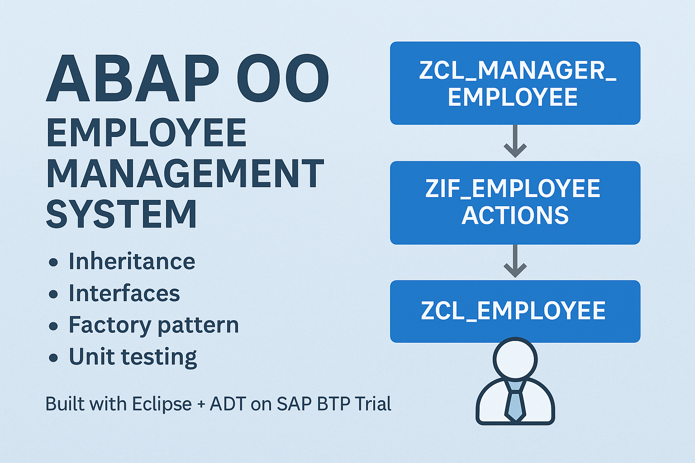

# 💼 ABAP OO Employee Management System



This is a complete object-oriented **ABAP training project**, designed to demonstrate core concepts in ABAP such as:

- Inheritance
- Interfaces
- Factory pattern
- Internal tables
- Unit testing
- Code organization using classes

> 🧠 Built and tested using **Eclipse + ADT** on **SAP BTP Trial** — without SAP GUI.

---

## 📦 Project Structure (Package: `ZDEV_TRAINING_V2`)

| Object Type       | Name                    | Purpose                                               |
|-------------------|-------------------------|--------------------------------------------------------|
| Class             | `ZCL_EMPLOYEEE`         | Base class to store employee info                     |
| Class             | `ZCL_MANAGER_EMPLOYEE`  | Inherits from employee; adds manager-specific logic   |
| Interface         | `ZIF_EMPLOYEE_ACTIONSSS`| Standard contract for all employee actions            |
| Class             | `ZCL_EMPLOYEE_FACTORY`  | Factory pattern to instantiate employee objects       |
| Class             | `ZCL_EMPLOYEE_RUN`      | Entry point to run the program                        |
| Class             | `ZCL_EMPLOYEE_REPORT`   | Generates a readable employee report                  |
| Class             | `ZCL_EMPLOYEE_STORAGE`  | Stores employee data in internal tables               |
| Class (Test)      | `ZCL_EMPLOYEE_TESTS`    | Contains unit tests using `cl_aunit_assert`           |

---

## ⚙️ Key Features

- ✅ **Modular Design** using ABAP OO
- 🧱 **Factory Pattern** to dynamically create objects
- 🧪 **ABAP Unit Tests** for reliable testing
- 📊 **Data Reporting** and internal storage simulation
- 🧩 **Interface Integration** for loose coupling

---

## 📸 Sample Output

```txt
Employee Report for Sara Omar (ID: 34) - Email: sara.omar@example.com
